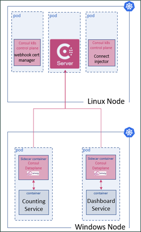

# Windows Consul Kubernetes Deployment Learning Guide

## Index

- [About](#about)
- [Prerequisites](#prerequisites)
  - [EKS Cluster Requisites](#eks-cluster-requisites)
  - [Docker Images Requirements](#docker-images-requirements)
- [Deploying a Windows Demo App into EKS Cluster](#deploying-a-windows-demo-app-into-eks-cluster)
  - [Deploy Counting and Dashboard Service](#deploy-counting-and-dashboard-service)

## About

This file is meant to be used as a guide in the process of deploying Consul Service Mesh to secure pod communication with other pods and external Kubernetes services in Windows nodes running in AWS EKS. By following this guide, you should be able to deploy a Windows workload in service mesh with proxy. Consul server, cert-manager and connect-injector will be deployed in Linux nodes.
> [!IMPORTANT]
> It is important to note that currently the automatic Consul sidecar injector does NOT work on Windows. This guide will teach you how to **manually** inject the required pods for Windows workloads to join the Consul Service Mesh.

## Prerequisites

### EKS Cluster Requisites

AWS EKS clusters must contain one or more Linux nodes to run core system pods that only run on Linux (such as coreDNS), also, we will be deploying a Consul Datacenter using Helm on those Linux nodes. You will need to follow these steps described [here](https://docs.aws.amazon.com/eks/latest/userguide/windows-support.html) to enable Windows support in your EKS Cluster.  
> [!IMPORTANT]
> In case you don't have a AWS EKS cluster deployed with Consul installed, you can follow this [guide](./k8s-v1.0.x/helm-charts/README.md).

### Docker Images Requirements

The following Windows Docker images need to be uploaded and available in a registry (such as Docker Hub or AWS ECR):

- Windows Consul Docker image: used Consul binary for Windows `v1.14.0`.
- Windows consul-k8s-control-plane Docker image: used consul-k8s-control-plane Windows binary `v1.0.0`.
- Windows consul-dataplane Docker image: used official Windows Envoy `v1.24.0`, Windows consul-dataplane custom binary used (`v1.0.0` as base).

You can read more about how to build these images and test them locally [here](./k8s-v1.0.x/dockerfiles/README.md).

## Deploying a Windows Demo App into EKS Cluster

For this guide we will be deploying the Windows versions of HashiCorp's Counting and Dashboard demo services. We provide the Dockerfiles to build the images for these services and will be up to you to upload them into a registry service of your choice (such as Docker Hub or AWS ECR). Below you can see a high-level architectural diagram of how your EKS will look like once you are done with this guide.



### Deploy Counting and Dashboard Service

Before executing the command to deploy the provided deployment YAML files, be sure to replace the images values to use the ones uploaded into the registry service of your choice, as we mentioned before.  
To read more about the necessary changes on the deployment YAML files to deploy both the **sidecar consul-dataplane** container and the **consul-connect-inject-init** init container, refer to [Windows Troubleshooting Documentation](WindowsTroubleshooting.md).  

Once you have modified both [counting-windows.yaml](k8s-v1.0.x/deployments/windows/counting-windows.yaml) and [dashboard-windows.yaml](k8s-v1.0.x/deployments/windows/dashboard-windows.yaml), replacing the **image** field value with your own, you can deploy the YAML files.  
Navigate with your terminal to the directory holding the YAML files we want to deploy and run the following commands:

1. Deploy Counting service:  
  
  ```bash
  kubectl apply -f counting-windows.yaml
  ```
  
  You will see the following output:  
  
  ```bash
  service/counting created
  deployment.apps/counting created
  ```

1. Deploy Dashboard service:  

  ```bash
  kubectl apply -f dashboard-windows.yaml
  ```

  You will see the following output:  
  
  ```bash
  serviceaccount/dashboard created
  service/dashboard created
  deployment.apps/dashboard created
  ```

#### Accessing your Deployed Services

Just like we access Consul's UI, to access the Dashboard service we can forward the port where the service is running and access navigating to [http://localhost:9002/](http://localhost:9002/). To do so, use the following command:

```bash
kubectl port-forward service/dashboard namespace consul 9002:9002
```

The app is fairly simple, when connected you will see a counter being displayed in big white numbers, on the top right side of your screen higlighted in green the word "Connected". On the other hand, ff the Dashboard service can't connect to the Counting service you will see the counter locked in "-1" and the label on the top right corner displaying "Counting Service is Unreachable".

#### Enforcing Intentions

Enforcing intentions is an important part of using a Service Mesh, using Consul we have 2 ways of enforcing them:

1. If you are familiar with Consul, you know that you can create intentions directly in the UI by navigating to the Intentions button on the left sidebar and clicking the "Create" button. Intentions created using the UI can only be viewed on the UI and will not be Synced to the Custom Resource Definition datastore.
1. On Kubernetes we can create Intention deployment YAML files. These can be viewed on UI but can't be managed by it, instead you can only delete them using `kubectl delete -f <intention YAML file>`. We have provided an [intentions file](./k8s-v1.0.x/deployments/windows/intentions.yaml) that will create 2 intentions:  
    1. Default intention: deny connections for all services as a default.
    1. dashboard-to-counting: allows communication *only* between those two services.
To apply the intentions file run the following command:

```bash
kubectl apply -f intentions.yaml
```

You will see the following output:

```bash
serviceintentions.consul.hashicorp.com/default created
serviceintentions.consul.hashicorp.com/dashboard-to-counting created
```
